# Model Context Protocol (MCP): A Practical Guide

> **Tip:** To zoom into any diagram, click **Open interactive view** under it. The diagram opens on mermaid.live, where you can pan and zoom (internet required).

This guide uses Claude Desktop as the client and **`my-datagpt-server`** as the example. That server is a local MCP server that connects Claude to a SQL Server `retail` database.

---

## Table of Contents

1. [What is MCP?](#1-what-is-mcp)
2. [What problems does it solve?](#2-what-problems-does-it-solve)
3. [Architecture](#3-architecture)
4. [Working with Claude Desktop as the client](#4-working-with-claude-desktop-as-the-client)
5. [Adding MCP servers through the config file](#5-adding-mcp-servers-through-the-config-file)
6. [Creating an MCP server](#6-creating-an-mcp-server)
7. [Seeing the tools a server exposes](#7-seeing-the-tools-a-server-exposes)
8. [Allowing or denying specific tools](#8-allowing-or-denying-specific-tools)
9. [Local (stdio) vs. remote (HTTPS) servers](#9-local-stdio-vs-remote-https-servers)
10. [Exposing a local MCP server with ngrok](#10-exposing-a-local-mcp-server-with-ngrok)
11. [Troubleshooting](#11-troubleshooting)
12. [Security checklist](#12-security-checklist)

---

## 1. What is MCP?

The **Model Context Protocol (MCP)** is an open standard that Anthropic introduced in November 2024. It defines how an AI application connects to outside tools, data, and systems. MCP is often compared to **"USB-C for AI"**: you build a server once, and any client that speaks MCP can use it. Examples of such clients are Claude Desktop, Claude Code, IDEs, and custom agents.

Under the hood, MCP uses **JSON-RPC 2.0** messages that travel over a **transport**. The two main transports are **stdio** for local servers and **Streamable HTTP** for remote ones.

An MCP server can expose three kinds of things to the model:

| Primitive | Who controls it | What it is | Example from `my-datagpt-server` |
|---|---|---|---|
| **Tools** | The model decides when to call it | Functions with side effects or computation | `run_query`, `get_tables`, `get_stock_price` |
| **Resources** | The application or user decides | Read-only data addressed by a URI | A table's schema exposed as `schema://orders` |
| **Prompts** | The user picks one | Reusable prompt templates | "Top-N analysis by dimension" |

The client can also offer capabilities back to the server:

- **Sampling**: the server asks the client's LLM to complete some text.
- **Roots**: the client tells the server which folders or URIs it may access.
- **Elicitation**: the server asks the user for input partway through a task.

---

## 2. What problems does it solve?

Before MCP, each AI app needed its own custom integration for each data source. With M apps and N systems, that meant **M × N** integrations.

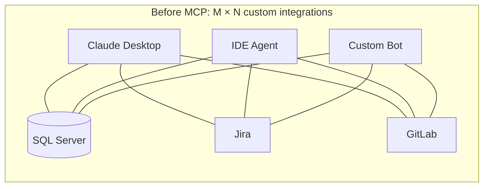

> 🔍 **Zoom:** [Open interactive view (pan/zoom)](https://mermaid.live/view#pako:eNptkEFrwzAMhf-K8GmFBdr6MOitTcboSMe2HO0e3FhpzBI7OPLGKP3vc0gHKa1O0nvSB3onVjqNbAWsatxPWStPkH9KC7H6cDh61dWwwcp5FJKNDezS9xXsQIb5XD_BG5ShJ9eCsYTxgIyzvWT7ETLUeiHSRgWNkGH_Ra7bQ5IkUCzEQ_GRQ4H-G_3s6mBcWIpX49Udg4sXQ7k6TK2l2GbPsD6ipX_-1L0QbyU-kbhIx1827h6E30L4FQStlpY9AmvRt8roIdiTZFRjizIOkmmsVGhIsvOwpgK54teW0SIfMCqh04owMyom2V7k8x-0t3Qo)


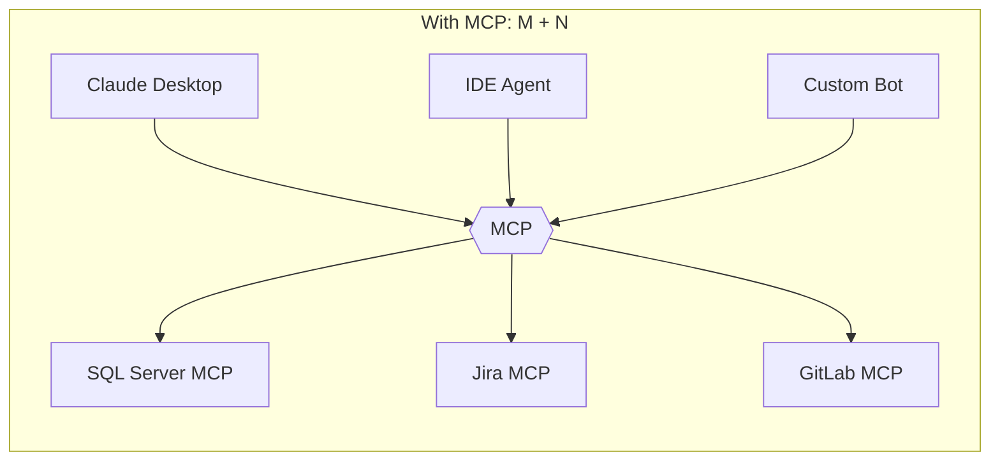

> 🔍 **Zoom:** [Open interactive view (pan/zoom)](https://mermaid.live/view#pako:eNptkLFqwzAQhl_l0NpkSLJlKCR2CS12ceuhg-RBsc6xiCUZ-dRSjN-9cpvBkN52__cdHP_IaqeQ7YE1nfuqW-kJsndhIc4Qzhcv-xYODaHngn1oaiFPij3k8ACvglV_4jzHDU86GRRCisOVXF_Bev0IxTjGg2laiFv-nD7B4YKWbs4C7ngSBnIGju6eFr9BvuHlWwYl-k_08zvVnbHlL9rL_9mOnzRl8rygaJWwbAXMoDdSq7mOUTBq0aCIi2AKGxk6EmyaNRnIld-2joh8wJiEXknCVMtYmLnF0w8X02Ow)


| Problem | How MCP addresses it |
|---|---|
| A separate, one-off integration for every app and data source | One standard protocol. You write a server once and any client can use it. |
| LLMs only know what was in their training data | Tools and resources give the model live access to your data (for example, the `retail` DB). |
| Each vendor has its own function-calling format | Standard `tools/list` and `tools/call` messages, with tool inputs described in JSON Schema. |
| Hard to control what the AI is allowed to do | The client has a permission layer: per-tool approval, the option to disable tools, and human-in-the-loop checks. |
| Credentials leak into prompts | Secrets stay on the server side, in env vars or OAuth tokens, and never go to the model. |
| Every app needs its own plugin | Tools can be discovered at runtime. Clients ask the server what it can do. |

---

## 3. Architecture

### 3.1 Components

- **Host**: the AI application the user interacts with, such as Claude Desktop. It holds the LLM conversation and enforces permissions.
- **Client**: a connector inside the host. The host creates **one client per server**, and each client keeps a stateful 1:1 session with its server.
- **Server**: a program that exposes tools, resources, and prompts. It can run locally or remotely.

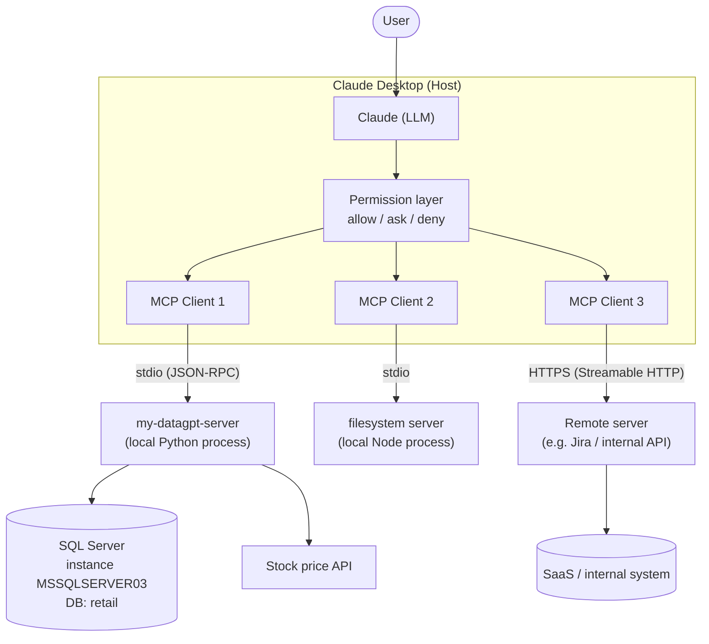

> 🔍 **Zoom:** [Open interactive view (pan/zoom)](https://mermaid.live/view#pako:eNptU9Fu2jAU_ZUrPwVptIW8VVOlEZC6CroM071gHkxyAQvHRrazKWr777tO0GhW_GDJ5_gen3tsv7LClsjuge20_VMcpAuwmggDNF48umQd582gQ3y93Tt5OsCj9WEtWKZlXSJM0R-DPUES4YFgm253HPP54rIvoVWfzmfLyOfoKuW9sga0bNB93brbB6nJEdyC9EeaSzRNrzQbUeEiyyHTCk2AUZ8d99lxn037bPq_ZxgOH1pzfastnI2ugeNrYNqBaMpLoi1DRwjTYdkoIm-C-VAqC8kT__E8XOYZBfUGPDZZNcNSBrk_hSHV_z7Hk2hbSA15Ew4U28nZAr2_pJuNP8q2WjGSndLoGx-wgs9az_QUriilZ6XH1SrnkPDgUFZyqxEi0vmMgS6xsgF7unizv4En5STdoDIBnaFjvuXfO_VOn7cBwHSyTgTjP-fALwLK-CBNgbDgxPDZ8tdseZe21HRyDw6DVFqwwaYnRQeQHR5scaR2FJUT8q8f3vYDXEq-TuL80VuXTdRjX4BV9C6lKuP3eBUsHLBCQQvBStzJWgfB3uM2WQfLG1MQFVyNhNQnujGcKknfpTrD738BRtMCvA)


### 3.2 Protocol layers

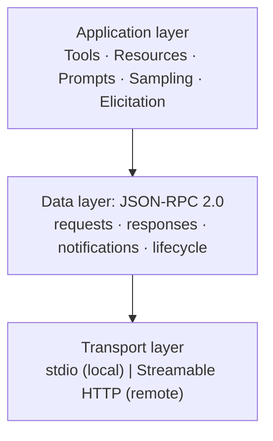

> 🔍 **Zoom:** [Open interactive view (pan/zoom)](https://mermaid.live/view#pako:eNpFkNtKAzEQhl9lyFULVnu4EIoU1AoioqW7d8aLaXa2DeSwzk6QUvvupsfNTZg_yffNZKdMrEhNQdUu_poNskD5pAPk9T760uqxaZw1KDYGcLglfljx3ayM0bWg03C4uocltTGxoWuw4OgbuZYF-swI60v9koFWjkitvs-ucXbNUfAkmcJb8fkxWC6eYXw7PCqZfhK1HZWpbWJoO2uIYutzq9fQ2ZrM1jjqTJNsKhlDfp6H7WZqpbIRei4adH34g0KY0OPKEbyW5QJ6TD4K9TvSCAaDWW79tE10UDegPLFHWx2-dKeVbMhn9xS0qqjG5ESr_eEaJonFNph8JJwoJ6mpUGhucc3oz_H-H-1-hw8)


### 3.3 Connection lifecycle

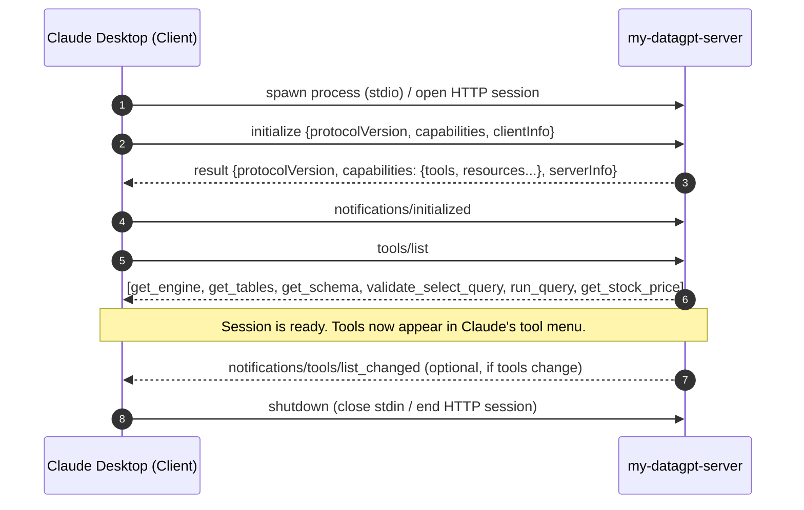

> 🔍 **Zoom:** [Open interactive view (pan/zoom)](https://mermaid.live/view#pako:eNqFUrFu2zAQ_ZWDltqALO8esiSDugQBZHSJAuFMnmUiFMmSxwSu4X_v0XKRCh2q6ah79_je8V0q5TVVO6gS_czkFD0ZHCNOvQP5MLN3eTpQnM8BIxtlAjqGFjDBo8WsCZ4ovbMPsHq0hhyv_0V3BT2dNxoZx8CbRPGjsM7IdvPw0O0gBfx0EKJXlBKsEmvj17AFH8hBu9-_QJKG8csp4wwbtOYXwUVm2Stvf1AsuBoUBjwYKwhKcrrJ--6O_jpTdBvhaHcQKWXL_5nfwYW9t8IjcJ-jqGya5lrDbOYv2rsy59kcjUIWqrT90qkXqBvn1prES02vI_FAbjSOaig148EWF6VO6kQT1vAhhLJTGhJZUjzII8azCMzuT3lDi6n3IUSj6G2-5NkzgRfV0NaioZv3CiaJN9TnBvZFlTj4BAyBMMqa76_9Ld0kw0QuN0vJS8NfxgZ1QjeShpUPpYe2BnOcncPcWy-TcMqsvYRhpaxPBCUKTpJATi-CIFNVDdVEcUKjS44vfcWyGurl0FeajigP21fXAitx7s5OSYtjlq1WOZTl3TN__339DeRQDxs)


### 3.4 A real tool-calling flow

This example uses the earlier question *"Top 3 products by volume in each state"*:

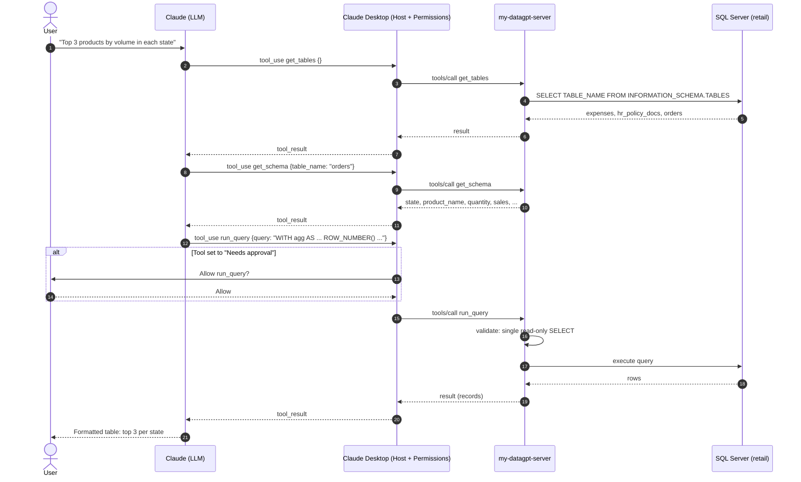

> 🔍 **Zoom:** [Open interactive view (pan/zoom)](https://mermaid.live/view#pako:eNqVVE2P2jAQ_SujnFgV6KE3DltBAIHER0tAe0GKjDOFqI6d9Qe7EeK_dxwTYFW6UnOJbL-ZeW_8xqeIqwyjHkQGXx1KjsOc7TUrthLoY84q6Yod6suaW6VhA8zAxjSbJdM253nJpIXYH8WCuQyhNZvNn_6GTO4gQzS_rSqhNVHGwhf4gbrIjcmVNA8iEx9ZVJ2MWbYvbYcYHB-RGA48MPk5g6RGQEujZbmglAG86Tw_xz3YRmuq_Q1KrTLHrYFdBUclXIGQS0DGD2Ass7iNQlhMYZMeWKVE6gzCHm1q2U6ggdM5QCYESQLEfOVMiDtQQCSEGA56kIxmo3gN6_5gNkoX_fkIxqvlHKaL8XI176-ny0WaxJPRvN-tIUmIHg46oQK-lygNmjYcdFoqkfMqzRSntdIZ6muxQFmjccI2FIP6Wsb9wSN5hh-wYHCqFaSSFejbdikRfSo6hH7kUbez3TS8zteGV0eXltuqDYYJr6jb7f4nVe1kSvbVFZzqnyf5Ml2T1fZ76Cc-I6yWL-liMx-MVq2nukRDnwkLa8oEBi2lpNAFYmaAlcTzyERz_Y3UTQ_6Qqi3W9XvN8DmorRGhG2U2b_6dM1w8wYBqGZOHqdWm1zuBclDlnWUFNXFNR-dhO_InUW4S3S1iVZvD63gR4LTNTZj9kmng-Kx0gWzFjOoreCR9ejQdIUZkVEbooLml-WZf09O28iSAWh4_GVk-Iv5nNHZw_yzklSS05HVjiwQudILvrw9l-3zH9Hzdws)


Claude never connects to SQL Server directly. It can only **request** a tool call. The host decides whether the call runs, and the server decides what the call is actually able to do.

---

## 4. Working with Claude Desktop as the client

Claude Desktop (macOS and Windows) is an MCP **host**. You can connect servers to it in three ways:

| Method | Transport | Best for | Where to configure |
|---|---|---|---|
| **Config file** (`claude_desktop_config.json`) | stdio (local process) | Your own dev servers, such as `my-datagpt-server` | Settings → Developer → Edit Config |
| **Desktop Extensions** (`.mcpb` bundles, formerly `.dxt`) | stdio, packaged | One-click install of local servers with no JSON editing | Settings → Extensions |
| **Custom Connectors** | Streamable HTTP over HTTPS | Remote / hosted servers | Settings → Connectors → Add custom connector |

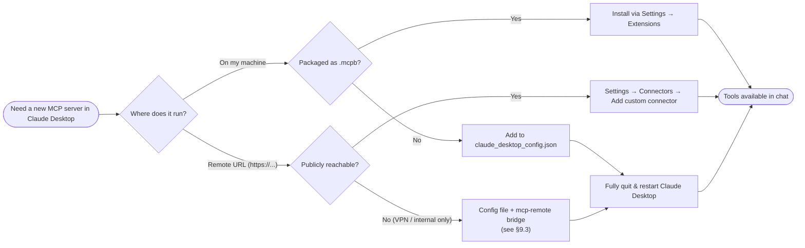

> 🔍 **Zoom:** [Open interactive view (pan/zoom)](https://mermaid.live/view#pako:eNpdUl1vGjEQ_CsrP1SgliPAQxVUpUoPEkVKgRykSXV3ioy9gBufTf1BihD_vb47oDR-8-7Ozszu7gjTHEkfyELqN7aixsF9kikIb-rCr5GOEDlQUPgG3-MJWDQbNCAUxJJ6jjBA--r0Om9Cq3UFD53d0woNAtdoQTgwXn3d1w0fOqEEMjJWUGyhoGwlFGakxnV3E8pe6bIksxAVbD0_4bol7mfoV1YOn2fpnbKOSgkbQWGKzgm1tJD5bueyC8M_DpUVWtn8HD7SFTq-uU2vOQengVX6X3it_4VptRDL6JfVKv9fb4KFdgiPyT00Vs6tbb_djqKoeZTe2038XAomt2AwuKJziSftvXPt8XiUvtcba6WQOW1OkVIf89bpAtgxmZ-3y0hw0_gxGUE7LMKhUVSCVnJ7lPQtuRvcDtOMxJUpWAiJ8BHCUFumNjM3gi_xy9y0rxoWMVBfXNDPl1EvtDhwhVFVzZLhdHadzNIbL4PD3z4s9UMwasvzeH8ENTKsqEI-ToeNdKa1tEA3VMhyMOXlhBG5vHlgGY-OtXWg1n7OXMcPn3_F5BOQAk1BBS8PeJcRt8IiHFQ_DIjjgnrpMrIvy6h3erpVLKSc8Rgifs2pw4GgS0OLQ3j_F7Sn8Jo)


**Day-to-day use**

1. Start a chat and ask in plain language, for example *"List the tables in my retail DB."*
2. Claude picks the right tool, the host checks its permission setting, and then the tool runs.
3. Use the **tools menu** in the chat input (the "+" / "Search and tools" button) to see which servers are connected and to switch servers or individual tools on or off for that chat.

---

## 5. Adding MCP servers through the config file

### 5.1 Config file location

| OS | Path |
|---|---|
| **Windows** | `%APPDATA%\Claude\claude_desktop_config.json` |
| **macOS** | `~/Library/Application Support/Claude/claude_desktop_config.json` |

The fastest way to open it is **Claude Desktop → Settings → Developer → Edit Config**. That creates the file if it doesn't exist and opens its folder.

### 5.2 Schema

```json
{
  "mcpServers": {
    "<server-name>": {
      "command": "<executable>",
      "args": ["<arg1>", "<arg2>"],
      "env": { "KEY": "value" }
    }
  }
}
```

| Field | Required | Meaning |
|---|---|---|
| `mcpServers` | ✅ | Map of server name → launch spec. The name is what appears in the UI. |
| `command` | ✅ | The executable to run: `python`, `uv`, `node`, `npx`, `docker`, or an absolute path. |
| `args` | ⬜ | Command-line arguments. |
| `env` | ⬜ | Environment variables for that process. Put secrets here, not in your code. |

### 5.3 Example: `my-datagpt-server` plus others (Windows)

```json
{
  "mcpServers": {
    "my-datagpt-server": {
      "command": "C:\\Users\\kiran\\OneDrive\\Documents\\model_context_protocal\\mcp\\Scripts\\python.exe",
      "args": [
        "C:\\Users\\kiran\\OneDrive\\Documents\\model_context_protocal\\mcp_server.py"
      ]
    },
    "filesystem": {
      "command": "npx",
      "args": ["-y", "@modelcontextprotocol/server-filesystem", "C:\\Users\\kiran\\Documents\\data"]
    },
    "internal-jira": {
      "command": "npx",
      "args": ["-y", "mcp-remote", "https://mcp.internal.example.com/mcp"]
    }
  }
}
```

**Rules that commonly cause problems:**

- On Windows, **escape backslashes** in JSON (`\\`).
- Use **absolute paths**. Point `command` at the virtual environment's `python.exe` (here, the `mcp` venv) so the server runs with the packages installed in it. Claude Desktop doesn't inherit your shell's `PATH` or working directory.
- The file must be **valid JSON**: no trailing commas and no comments.
- After saving, **fully quit Claude Desktop** (on Windows, from the system tray; on macOS, ⌘Q) and reopen it. Closing the window isn't enough.

### 5.4 What happens at startup

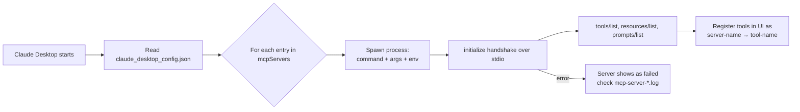

> 🔍 **Zoom:** [Open interactive view (pan/zoom)](https://mermaid.live/view#pako:eNpNkU1rwzAMhv-K8HHrB-ttZRTWrzHYqWUwSErRbCXxGtvBdlq60v8-xclhvhjJj95Xkm9COkViDqKo3UVW6CN87HILfF6zVY2tIlhTOEXXQIj8HA4wHi9gme0IFchEHFVPHKWzhS4nP8HZQy-yTPTqtnUeCGUFZKO_grZgZLMnfyYf7j26Sug6y8W-wYuFxjtJIcxfvv10IZ0xaBU8Avoy8EX2nIvBZJ0qN5m2Omqs9S9BxXCo8ETg2IJbV9oN9CbR2yw6V4dprUMcgafgWs92Q8zepol9NJRtU9kbz11ykjVTfTfJ5ztgSF2GNNDYoiHI29nT8yxRKfHPHch73ken95X1S4BQuUtgHShQ16T6oSuSp25R40H4YVK7koXECIQhb1Cr7u9uuYgVGco5yIWiAts65uLeYdhGt79ayU_Rt8SZtlEYaa2x9GiG9P0PhDysWg)


---

## 6. Creating an MCP server

The quickest way is the official **Python SDK** and its `FastMCP` API. Official SDKs also exist for TypeScript, C#, Java, Kotlin, Go, and other languages.

### 6.1 Set up the project

```powershell
cd C:\Users\kiran\OneDrive\Documents\model_context_protocal
python -m venv mcp                 # creates the "mcp" virtual environment
mcp\Scripts\activate
pip install "mcp[cli]" pyodbc sqlparse yfinance
```

Resulting layout:

```text
C:\Users\kiran\OneDrive\Documents\model_context_protocal\
├── mcp\                 ← virtual environment (mcp\Scripts\python.exe)
└── mcp_server.py        ← the MCP server
```

### 6.2 `mcp_server.py`: a reference implementation of `my-datagpt-server`

> Treat this as an illustrative example that matches the tool signatures exposed by `my-datagpt-server`. Adapt the details to your real code.

```python
import os
import re
from typing import Any

import pyodbc
import sqlparse
import yfinance as yf
from mcp.server.fastmcp import FastMCP

mcp = FastMCP("my-datagpt-server")

_conn: pyodbc.Connection | None = None


def _connect(server: str, database: str) -> pyodbc.Connection:
    return pyodbc.connect(
        "DRIVER={ODBC Driver 18 for SQL Server};"
        f"SERVER={server};DATABASE={database};"
        "Trusted_Connection=yes;TrustServerCertificate=yes;"
    )


def _db() -> pyodbc.Connection:
    global _conn
    if _conn is None:
        _conn = _connect(
            os.getenv("SQL_SERVER", r"localhost\MSSQLSERVER03"),
            os.getenv("SQL_DATABASE", "retail"),
        )
    return _conn


def _rows(sql: str, params: tuple = ()) -> list[dict[str, Any]]:
    cur = _db().cursor()
    cur.execute(sql, params)
    cols = [c[0] for c in cur.description]
    return [dict(zip(cols, r)) for r in cur.fetchall()]


@mcp.tool()
def get_engine(server: str = r"localhost\MSSQLSERVER03", database: str = "retail") -> str:
    """(Re)connect to a SQL Server database. Optional: tools connect to the default DB automatically."""
    global _conn
    _conn = _connect(server, database)
    return f"Connected to {server}/{database}"


@mcp.tool()
def get_tables() -> list[dict[str, Any]]:
    """Return all user tables in the dbo schema."""
    return _rows(
        "SELECT TABLE_NAME FROM INFORMATION_SCHEMA.TABLES "
        "WHERE TABLE_SCHEMA='dbo' AND TABLE_TYPE='BASE TABLE'"
    )


@mcp.tool()
def get_schema(table_name: str) -> list[dict[str, Any]]:
    """Return column names and data types for a dbo table."""
    return _rows(
        "SELECT TABLE_NAME, COLUMN_NAME, DATA_TYPE FROM INFORMATION_SCHEMA.COLUMNS "
        "WHERE TABLE_SCHEMA='dbo' AND TABLE_NAME=? ORDER BY ORDINAL_POSITION",
        (table_name,),
    )


_FORBIDDEN = re.compile(
    r"\b(INSERT|UPDATE|DELETE|MERGE|DROP|ALTER|CREATE|TRUNCATE|EXEC|EXECUTE|GRANT|REVOKE|INTO)\b",
    re.IGNORECASE,
)


@mcp.tool()
def validate_select_query(query: str) -> dict[str, Any]:
    """Check that a query is exactly one read-only SELECT (or WITH ... SELECT) statement."""
    stmts = [s for s in sqlparse.parse(query) if str(s).strip()]
    if len(stmts) != 1:
        return {"valid": False, "reason": "Exactly one statement is required."}
    first = stmts[0].token_first(skip_cm=True)
    if first is None or first.normalized.upper() not in ("SELECT", "WITH"):
        return {"valid": False, "reason": "Only SELECT / WITH ... SELECT is allowed."}
    if _FORBIDDEN.search(query):
        return {"valid": False, "reason": "Write/DDL keywords are not allowed."}
    return {"valid": True}


@mcp.tool()
def run_query(query: str, params: dict[str, Any] | None = None) -> list[dict[str, Any]]:
    """Run a read-only SELECT query and return rows as a list of records."""
    check = validate_select_query(query)
    if not check["valid"]:
        raise ValueError(check["reason"])
    return _rows(query, tuple((params or {}).values()))


@mcp.tool()
def get_stock_price(ticker: str) -> dict[str, Any]:
    """Fetch the current price of a stock given its ticker symbol."""
    price = yf.Ticker(ticker).fast_info["last_price"]
    return {"ticker": ticker.upper(), "price": round(float(price), 2)}


if __name__ == "__main__":
    mcp.run()  # stdio by default; see §9 for HTTP
```

**How the decorator maps to the protocol:**

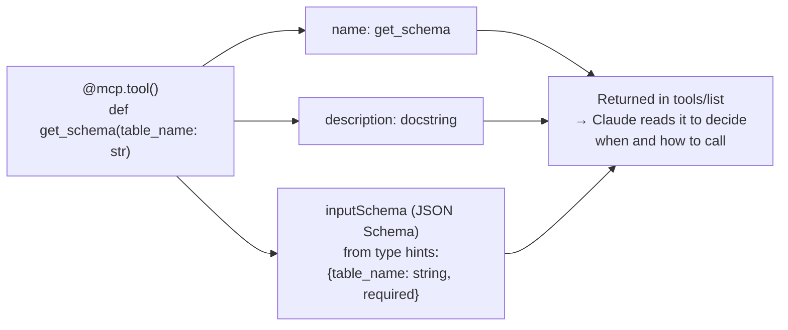

> 🔍 **Zoom:** [Open interactive view (pan/zoom)](https://mermaid.live/view#pako:eNpdkU9rAjEQxb_KkJOCVuqtS5FW7aWUFvTYFInJrBvIn212goj43TublbaY25v55b3J5Cx0NCgqELWLR92oRPC2kQH4PH9K8eR1e0cxutH4cZ9mC4M1HJB2nW7QqxGpvcNdUB4r6CiNpfiC6XQBS746VP9g7l19C7JixGCnk23JxlCBiZotbDjcgGsGbWgzbYsNjF63H-8wiGGoOkUPdGoRGhuoq0rxfDMbG08g4Xe2Cc3lN2NZMl4Gsfov1oPg9A1STgEN2AD9LrqZsx2VFJnn9w9zWDmVDbK9Mh1YYgoMamuwQMcGA6hgoInHvqWVc2UAMQHhMXllTf8FZymIX4WSRb-cWmVHUlx6TGWK21PQ3KKUkSu5NYpwbdUhKX8tX34AM7CVlQ)


**Tips for good tools**

- **Write the docstring for the model.** Claude decides which tool to call from its name, description, and parameter types.
- **Keep tools small and focused.** The split between `get_tables`, `get_schema`, and `run_query` works well: Claude discovers what exists before it queries.
- **Enforce safety in the server.** The read-only check in `run_query` protects the database regardless of how the client's permissions are set. For defense in depth, also use a **read-only DB login**.
- **Never print to stdout** in a stdio server. stdout carries the protocol messages, so send logs to `stderr`.
- **Add tool annotations** (`readOnlyHint`, `destructiveHint`, `idempotentHint`, `openWorldHint`) so clients can show helpful UI. For example: `@mcp.tool(annotations={"readOnlyHint": True})`.

### 6.3 Test before connecting it to Claude

```powershell
# Interactive browser UI to list and call tools
npx @modelcontextprotocol/inspector C:\Users\kiran\OneDrive\Documents\model_context_protocal\mcp\Scripts\python.exe C:\Users\kiran\OneDrive\Documents\model_context_protocal\mcp_server.py

# or, with the Python CLI (venv activated)
cd C:\Users\kiran\OneDrive\Documents\model_context_protocal
mcp\Scripts\activate
mcp dev mcp_server.py
```

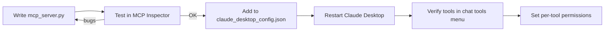

> 🔍 **Zoom:** [Open interactive view (pan/zoom)](https://mermaid.live/view#pako:eNpNkEFuwyAQRa8yYl3nAF1UqpyN1VaNHKte4MiiMHZoDVgwtIqi3L1AvCgr5vH-MHBl0ilkj8Cmxf3Ks_AEr-1gIa2e914TgpHrGND_oN-tlxNU1RM0vMNAoC281QdobFhRkvOne7BJDnzGORS3_wffXwqq-bNSQA7kIqLCUWH4JreO0tlJz7uv4OzWqi5-y9t0XZ6tLgHY3wOb1Bap4x_o9XRJfd0S8mzpObRVBm3c7K7YB35EghV9lYW8MToE7WxIGnsAZhIRWuWvuQ6MzmhwSMXAFE4iLjSwW9ZEJHe8WJmOyEdMJK5KEO61mL0wG779AYkCdB8)


---

## 7. Seeing the tools a server exposes

| Where | How |
|---|---|
| **Claude Desktop: chat** | Click the tools menu ("+" / "Search and tools") in the message box, then select the server to see each tool with an on/off toggle. |
| **Claude Desktop: settings** | Settings → Connectors (or Extensions / Developer). Select the server to see its tools, status, and permission settings. |
| **Ask Claude** | *"What tools are available in my datagpt server?"* Claude reads the tool definitions it was given. |
| **MCP Inspector** | `npx @modelcontextprotocol/inspector ...`, then the **Tools** tab, then **List Tools**. You can also run a tool by hand there. |
| **Raw protocol** | Send `{"jsonrpc":"2.0","id":1,"method":"tools/list"}` after `initialize`. |

**Tools currently exposed by `my-datagpt-server`:**

| Tool | Purpose | Parameters | Risk |
|---|---|---|---|
| `get_engine` | (Re)connect to a SQL Server DB | `server`, `database` (optional) | Medium: can point at another DB |
| `get_tables` | List `dbo` tables | none | Low (read-only) |
| `get_schema` | Columns and types for a table | `table_name` | Low (read-only) |
| `validate_select_query` | Check that SQL is one read-only SELECT | `query` | Low |
| `run_query` | Execute a read-only SELECT | `query`, `params?` | Medium: data exposure |
| `get_stock_price` | Current price for a ticker | `ticker` | Low (external network call) |

Sample `tools/list` response, abbreviated:

```json
{
  "tools": [
    {
      "name": "get_schema",
      "description": "Return column names and data types for a dbo table.",
      "inputSchema": {
        "type": "object",
        "properties": { "table_name": { "type": "string" } },
        "required": ["table_name"]
      }
    }
  ]
}
```

---

## 8. Allowing or denying specific tools

Permissions apply at **three layers**. Use all of them.

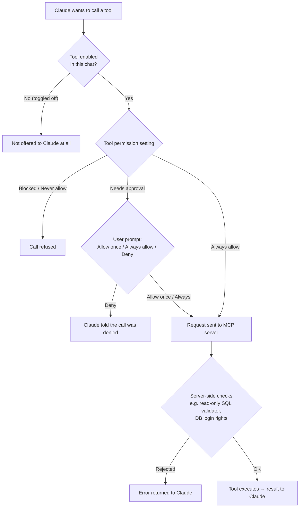

> 🔍 **Zoom:** [Open interactive view (pan/zoom)](https://mermaid.live/view#pako:eNptUlFv0zAQ_isnP4G0blrhhQkNtUnHA1BgHRIo6YMXXxIzxw72ZVlV9b9zTlLUSvjJd77v--67814UTqG4AVEa1xe19AQPaW6BzyJLjOwUQi8tBSAHhTQGJN-c2cJsdgvL_QPfAa18NKjeP_qrW22Bah2AuejDYWRacjHkYu3gFbmq4lJwZfk6FwPJz-ts7Shm0PML60y6koAFtyccvzAMkGTUbdE3OgTtLAQk0raaBJNRcGlc8cSUV7DGZ_SRzfVH1XmWRDseyy6g2p4B14gqgGxb756lmRDp_kdgEs41Ld0MZheREJwtkDUWppe7MIpwmKLdTe2kkTXGo_Kb42DJGfZb4zjYXgZQaPW_ZtKxmf-ITB2tsnv802Egtm8pTu5L8o3vns2eGzrt7QgeC1ZDcLffDKhZ0NxXUWPxFAaHeFld8oykmjlrdrD5_hl4IlpJcv5iqEiXYFzFa_e6qilMlu-i7j3-xoJ4AYPtt9nKe-eZjTpvTze9PcF8_TRUf8zGn_WCRUe89bybX7-bMzZ0hs6Q4gJEwx9BahX_8T4XPNEGcw5yobCUDMjFIZbJjtxmZwt-It8hZ7qWnWCqZeVlM6UPfwGWlvmy)


### 8.1 Layer 1: per-tool permissions in Claude Desktop

1. Open **Settings → Connectors** (servers added through the config file may be listed under **Developer** or **Extensions**, depending on the app version).
2. Select the server, for example `my-datagpt-server`.
3. For each tool, choose a permission. Exact labels can vary between app versions:
   - **Always allow**: runs without asking. Use this for safe, read-only tools.
   - **Needs approval**: asks you every time, or until you click **Always allow** in the prompt.
   - **Blocked / Never allow**: Claude can't use it.

**Suggested settings for `my-datagpt-server`:**

| Tool | Recommended setting | Why |
|---|---|---|
| `get_tables`, `get_schema`, `validate_select_query` | Always allow | Metadata only, read-only |
| `run_query` | Needs approval (or Always allow on dev data) | Returns business data, so review the SQL |
| `get_engine` | Needs approval or Blocked | Could switch to a different / production DB |
| `get_stock_price` | Always allow | Harmless public data |

### 8.2 Layer 2: per-chat toggles

In the chat's **tools menu**, switch off an individual tool or the whole server for that conversation. A disabled tool isn't sent to Claude at all, so Claude can't even try to call it. This also saves context tokens.

### 8.3 Layer 3: server-side enforcement (the most reliable)

Client settings belong to each user and can be changed. For hard limits, enforce them in the server:

- **Don't register the tool** in that environment (for example, skip `get_engine` when `ENV=prod`).
- **Validate inputs**, as the SELECT-only validator in `run_query` does.
- **Use least-privilege credentials**, such as a SQL login with `db_datareader` only.
- **Use an allowlist via env**, for example:

```python
ENABLED = set(os.getenv("ENABLED_TOOLS", "get_tables,get_schema,run_query").split(","))

if "get_engine" in ENABLED:
    mcp.tool()(get_engine)
```

```json
"my-datagpt-server": {
  "command": "C:\\Users\\kiran\\OneDrive\\Documents\\model_context_protocal\\mcp\\Scripts\\python.exe",
  "args": [
    "C:\\Users\\kiran\\OneDrive\\Documents\\model_context_protocal\\mcp_server.py"
  ],
  "env": { "ENABLED_TOOLS": "get_tables,get_schema,validate_select_query,run_query" }
}
```

---

## 9. Local (stdio) vs. remote (HTTPS) servers

### 9.1 Comparison

| | **Local: stdio** | **Remote: Streamable HTTP (HTTPS)** |
|---|---|---|
| Runs where | As a child process on your machine | On a server, container, or cloud service |
| Launched by | Claude Desktop, from the config file | Already running; the client connects to its URL |
| Transport | stdin/stdout, JSON-RPC lines | HTTP POST (+ optional SSE stream) at one endpoint, e.g. `/mcp` |
| Auth | OS user / env vars | **OAuth 2.1** (spec standard), or API keys / headers |
| Users | One user, one machine | Many users, shared |
| Can reach | Local resources (e.g. `localhost\MSSQLSERVER03`, local files) | Whatever the host network can reach |
| Added in Claude Desktop via | `claude_desktop_config.json` or `.mcpb` extension | Settings → Connectors → Add custom connector |
| Good for | Personal and dev tools, local DBs, files | Team-wide tools, SaaS integrations, central governance |
| Example | `my-datagpt-server` | A hosted Jira / GitLab / internal-API MCP |

> The older **HTTP + SSE** transport (two endpoints) is deprecated in favor of **Streamable HTTP**. New remote servers should use Streamable HTTP.

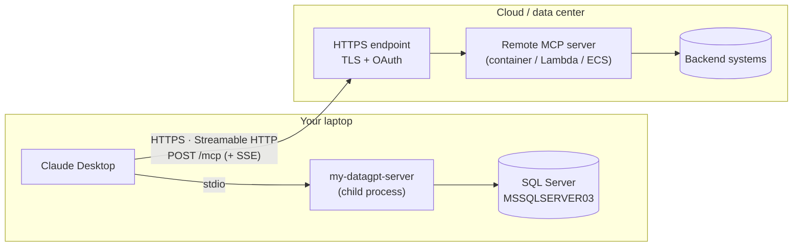

> 🔍 **Zoom:** [Open interactive view (pan/zoom)](https://mermaid.live/view#pako:eNplUk1LAzEQ_StDTi1aWvEgiAh2W_CwYt0UoTQesptpd3GTLPlQivrfnWxFXZ3LJG9eZt488sYqq5BdAtu19rWqpQuQF8IAhY_l3smuhlx2wXZbwTY2Omj7m2BPR1aKbLHNWhkVwgL9M1V_1VZn9FAfJkoGue_CxKN7QXdVuun1qKqbVkHnbIXejwct-UO-HQlGCfjPiztOAF8Wj8tidi7YeKABJpPrd8F8UI0V7J0m_1aRqqnrEUOjhPmzZtbaqEhsn2EKSTFUaAK6gbR8TqTb9XrFU5vONib04tY5hxO4v4mhHvALTvwCtQ0Id9kKBg5YE2Rj0NG8XOpSSTosM_7HjA3fjuayeqZ54A8-oPbjgaJ-u4Ifl9zwf0t-u3PULeJsVl4ADw6llmWLkPBe0uqer2Gqqw5GJ8D5cpyszOfCsFNgGp2WjUr_5U2wUKNGQRfBFO5kbINgH4kmY7D8YCoqBReRkNiRm7hoJFmtv-CPT1KKvnQ)


### 9.2 Running the same server over HTTP

FastMCP can serve over Streamable HTTP with a single change:

```python
if __name__ == "__main__":
    import sys
    if "--http" in sys.argv:
        mcp.settings.host = "0.0.0.0"
        mcp.settings.port = 8000
        mcp.run(transport="streamable-http")   # serves http://host:8000/mcp
    else:
        mcp.run()                               # stdio
```

For real deployments, put it behind **TLS** (an ALB, API Gateway, nginx, etc.) and add **authentication** (OAuth 2.1 per the MCP authorization spec, or at minimum a gateway that checks tokens).

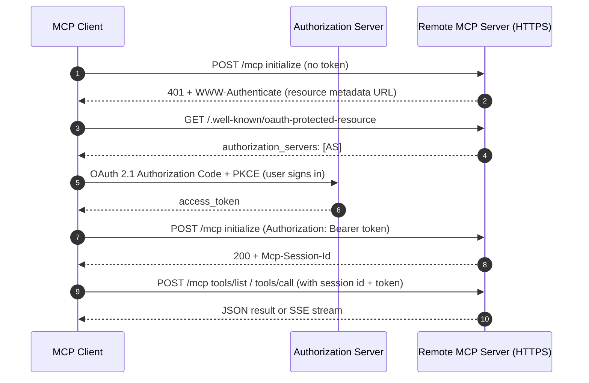

> 🔍 **Zoom:** [Open interactive view (pan/zoom)](https://mermaid.live/view#pako:eNqNUsFu00AQ_ZWRT46Km7Ti5EMlYyIoUBJ1g3LAVTWsh3bV9a7ZnSWiVf-dcZwCKUHCt1m_ee_Nm3nItG8pKyGL9C2R0_Ta4E3ArnEgHyb2LnVfKIx1j4GNNj06hhowwkW9hNoacvw3oFIDokp864O5RzbegaLw_RDZFnpJnWfaco44yN-uVks1adzYURdnZ6qE5UKtYNrpHowzbNCae4LceWB_R24yYlUh4LqEl7MTOIL1el0MTsSo0SgieaDoU9AEHTG2yAifLj9M9nTezEXmeEPWFnfOb9zUSx63RR_EpWZqiyeOfUX8c-LruJ0klvC5Ule_6SvhXwyO4PT45FlItaxEPC_f13PIkxBANDcuyrQ7f9UvKa0pxuvt3P8R0Z5MCa8Ig5AfSu10NhMHF7ovlAgIujhv_yHA3ts4tSYyTHeFRmsh3xiZLo7tYFrhO6T0Ti0-ggSZLIMPoNQcIgcaLjB7AVlHoUPTDhf60GSywI4aKZqspa8oPU32OMCGQ1U_nJZfHBLJS-plqU_XvHt-_Amr-PGd)


### 9.3 Connecting Claude Desktop to remote servers

**Option A: Custom Connector (recommended for public HTTPS servers)**

1. Settings → **Connectors** → **Add custom connector**.
2. Enter a name and the server URL (for example `https://mcp.example.com/mcp`).
3. Complete the OAuth sign-in if the server asks for it.
4. Set tool permissions as described in §8.

> Custom connectors may be brokered through Anthropic's cloud, so the URL generally needs to be reachable from the public internet. `localhost` or VPN-only URLs won't work this way. To expose a server running on your laptop, use a tunnel such as **ngrok** (see §10).

**Option B: `mcp-remote` bridge (for internal or VPN-only servers)**

`mcp-remote` runs locally as a stdio server and forwards traffic to the remote HTTPS endpoint. That lets the connection originate from your machine and network:

```json
{
  "mcpServers": {
    "internal-api": {
      "command": "npx",
      "args": ["-y", "mcp-remote", "https://mcp.internal.example.com/mcp"]
    }
  }
}
```

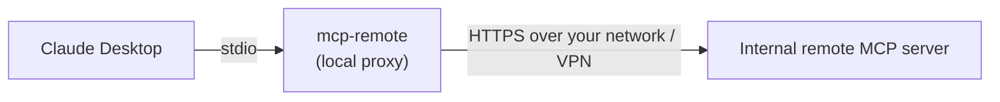

> 🔍 **Zoom:** [Open interactive view (pan/zoom)](https://mermaid.live/view#pako:eNotjk1vgzAMhv-K5dMmDfU-Tb3AYZPGhKDqhfSQEbdFTTAyTjtU-t-XrvPt_XrkK3bsCF8B954v3dGKwmdtBkiXF23ubXQEBU0n5XEHWbZeJnU9L1DWrcHQjZlQYKW3b1mtnzx31sMo_DM_G9w9OGX9tzP4vtlUDfCZBGaOAgPpheUEK9hWXwYXqJv2Y1CSIUEeWCjzCiaStEk0fAEMJMH27v7y1aAeKZBJwqCjvY1eDd7uNRuVm3noUqQSKTlxdFap6O1BbPi3b79T_lTh)


## 10. Exposing a local MCP server with ngrok

### 10.1 What is ngrok?

[ngrok](https://ngrok.com) is a **secure tunneling service**. It gives a server running on your laptop a **public HTTPS URL**, such as `https://smartness-protozoan-container.ngrok-free.dev`, and forwards every request through an encrypted tunnel to a local port, such as `http://localhost:8000`.

The ngrok **agent** on your machine opens an **outbound** connection to ngrok's cloud edge. Requests arriving at the public URL travel back down that connection. You don't open any inbound firewall ports or change router settings.

### 10.2 What problem does it solve for MCP?

Claude **custom connectors** (§9.3) need a remote MCP server URL that is reachable from the internet over **HTTPS**. Your `my-datagpt-server` runs on your laptop and talks to a local SQL Server instance (`MSSQLSERVER03`), so the internet can't reach it directly.

| Problem | Without ngrok | With ngrok |
|---|---|---|
| Claude's cloud can't reach `localhost` or `192.168.x.x` | Connector fails | Public URL forwards to localhost |
| Home or office router uses NAT and a firewall | You'd need port forwarding and firewall rules | Outbound tunnel only, no inbound ports |
| HTTPS needs a domain and a TLS certificate | Buy a domain, set up certificates | ngrok terminates TLS with a valid certificate |
| Moving to the cloud means deploying the server plus a DB connection | Containers, VPC, secrets and so on | Data stays on your machine, and you only expose the MCP endpoint |
| Debugging remote calls is hard | Add logging and redeploy | ngrok web inspector at `http://127.0.0.1:4040` shows and replays every request |
| Using your server from claude.ai web or mobile | Not possible with a stdio-only server | Works anywhere the connector is enabled |

**When to use it:** demos, prototyping, testing a remote MCP server before deploying it, and using your local tools from claude.ai web or mobile.

**When not to use it:** production, or anything that touches real or regulated data. For those, deploy the server properly (for example on AWS ECS, App Runner, or Lambda) behind proper authentication.

### 10.3 Architecture

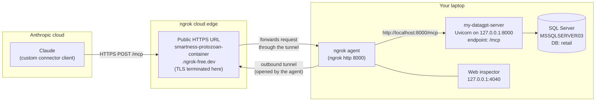

> 🔍 **Zoom:** [Open interactive view (pan/zoom)](https://mermaid.live/view#pako:eNp9U2Fv0zAQ_Ssnf1ol0mYwCRShSVtbDaRQStMNoYUPjn1NIhI7OPamsu2_c7FLR5iE8yHO-b2753eXBya0RJYA2zX6XlTcWEg3uQJavStKw7sKLpStjO5qcZuz4x5Eo53M2fcAHtY8JcC84U7i-8LMzk-E661uQWilUFhtiFOjspMjC5X8p9aqNPoHpVHDO9QAlCWOCi0XV0vCrF3RkJAP2-06g-tN6ov2Ld1BYd9HndFW_9JcRSTA8lqh8Yipzx3tDOJU4l2Quk0zsGjaWnGLEio0-D-ZKe-s7kjDN-0MNP5rJPHiarnaHu_BS7p2KBQClbUdvIvjeDJiZZsb4rT7SHLLy85GPZq7g-zru1poo0ArOH39dhrTc5oMKfwpSex0rWwCs1aMpSwub09yln1JIXvO9imjQLbc3Cw38RsfWVwmYJB8anI2-Yv-cZWtSdRXLKBWfecb6QnPKs7is_ilWfMUouj8MWehQevP2fYg7tF3MKC8UQegdrbQTkmwjiamCYbpDhV1pNiDrTA4ORmnGHaHDDtt7rmRPd3kp8M-eD5MrCsrzw-ZB74v_FLD0JlkNmu04E2le-st_iOb-hMYtBnw5O04Q-TtyhV7BaylceK1HH6uh5xR8ZamOIGcSdxx19icPQ0w7qzO9krQkTUOKeI6aj8uak6z1h7CT78Bt34lsQ)


### 10.4 Request flow

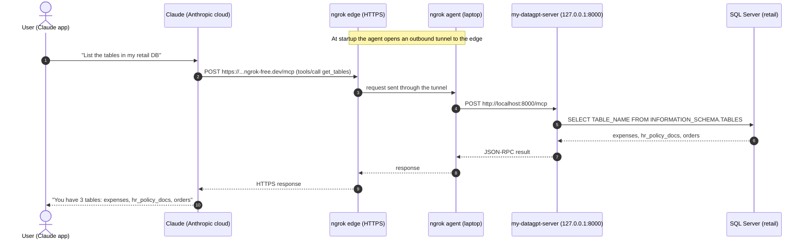

> 🔍 **Zoom:** [Open interactive view (pan/zoom)](https://mermaid.live/view#pako:eNqNk8Fu2zAMhl-F8CkDGifdDht8KOA4KdohcbI6OQwIEKg2axuzJU2iigVF332U5WDDkMPsk8iP5E9SeotKVWGUQGTxp0NZ4rIVtRH9UQJ_wpGSrn9GM55LUgYOICwcLBqYZJ1wFYLQ-kMgtDDUlq0WkiDz3EhMUkmNUbotoeyUq67gucdlbdQPwKrmkIf9fldcAdM_oKiRDZNOaFLXJBQe7c_TSpCoNU1Z9KvXffvxczzn_zb5Mp_PrwQuFz6y-LaGYgwxSKLtGA1wrghBeU96kyeQEljieKeBGhx1KY3SgpCgHD0rJysgJyV2QGqgfJsh22F6d5clcIzWraXBR-K5QwutZPkQarOoYxT4jHmuutsWe2iItE1msziOh6FMXwxiXOHrrC81TEipzs5K0XVQI51C3rHjnNOkCafn3XNd60X7Nbm6CSIGuYFNmS3-KskVO8VpG2VpmKIvF9CC0eUigWK1XmV72KeL9eqUp5sV3D9tN_CY32-fNun-cZufiuxhtUnjASlC9HIxDaXwl58f2htozEmrri3Pp0qVfFamQmMvxUITX4ttPn3aZdyNdR1dRIdBsU0rznVpO4x7uGD_-DLvO_hVfFcOGvGK8Glcxn8o4vVENxD1aHrRVv5dvR0jnmSPx8jnrPBFeHHRu8f88yrOsmQXGYdscZpv6uUNjub334tOK1U)


### 10.5 Step-by-step setup

**Step 1: Install ngrok and add your auth token (one time only)**

```powershell
winget install ngrok.ngrok          # or download from https://ngrok.com/download
ngrok config add-authtoken <YOUR_NGROK_AUTHTOKEN>   # from dashboard.ngrok.com
```

**Step 2: Make the server support both stdio and HTTP**

Keep one file that works both ways. Claude Desktop's config (§5.3) starts it in **stdio** mode, and you start it with `--http` when you want the tunnel.

```python
import sys

if __name__ == "__main__":
    if "--http" in sys.argv:
        # Bind to 127.0.0.1 so ngrok (which forwards to localhost) can reach it,
        # without exposing the server to the rest of your LAN.
        mcp.run(transport="http", host="127.0.0.1", port=8000)
    else:
        mcp.run()  # stdio, used by claude_desktop_config.json
```

> If you use `from fastmcp import FastMCP` (FastMCP 2.x), the transport name is `"http"`. If you use the official SDK (`from mcp.server.fastmcp import FastMCP`), it's `"streamable-http"`, and you set host and port through `mcp.settings` (see §9.2).

**Step 3: Start the server (terminal 1)**

```powershell
cd C:\Users\kiran\OneDrive\Documents\model_context_protocal
mcp\Scripts\activate
python mcp_server.py --http
# INFO: Uvicorn running on http://127.0.0.1:8000
```

**Step 4: Start the tunnel (terminal 2)**

```powershell
ngrok http 8000
# or reuse your free static domain so the URL never changes:
ngrok http --url=smartness-protozoan-container.ngrok-free.dev 8000
```

ngrok then shows:

```text
Forwarding   https://smartness-protozoan-container.ngrok-free.dev -> http://localhost:8000
Web Interface http://127.0.0.1:4040
```

**Step 5: Test the public URL with MCP Inspector**

```powershell
npx @modelcontextprotocol/inspector
```

In the Inspector, set **Transport** to *Streamable HTTP* and **URL** to `https://smartness-protozoan-container.ngrok-free.dev/mcp`, then click **Connect** and **List Tools**. You should see all six tools.

**Step 6: Add it to Claude as a custom connector**

1. In Claude (desktop, web, or mobile settings), go to **Settings → Connectors → Add custom connector**.
2. **Name:** `datagpt`
3. **URL:** `https://smartness-protozoan-container.ngrok-free.dev/mcp`. **Don't leave off `/mcp`.**
4. Save, then open the connector and set per-tool permissions (§8). For example, set `run_query` to *Needs approval* and block `get_engine`.
5. Start a new chat, enable the connector in the tools menu, and ask *"List the tables in my retail DB."*

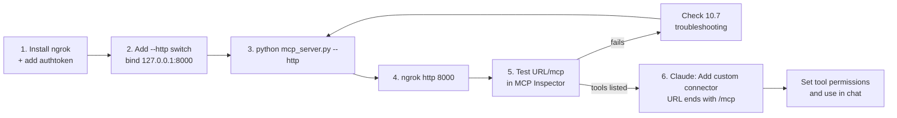

> 🔍 **Zoom:** [Open interactive view (pan/zoom)](https://mermaid.live/view#pako:eNpVkd2K2zAQhV9l0G03ip3fEpaFJb0ppFCS9KouiyJNIhFbMtK4IYS8e8dyaFrrytL5zpyZuQkdDIoViGMdLtqqSLDZVh7425U_K1FK-OoTqboGf4rh_HqI47dPoIwB1ZGlcEZfiV8wGr3BbsLARMI7P45GlqiFdHGkbYYOzhsoJ0tZ8ClXn4uiYPBRajIYTNlgKqG9kg0eGt1-JIy_Mcr2-nB8ItMBmTEyk0M4yDX_d54NsjnL5hL2mAh-bDdj9s6pnIdv6-99jy1qCvEJzhmEo3J1yg57Nlhb1GcoC7nMLMXQHWpMNgRy_vQX3T-a-deoEhQCW9UuEZpKDJIFmy4krGvVGVzlwekuUWhAB-9zoFyJEwN6k4DHaaEP_8y5GKyWbLVDgr4MtBgbl5ILPmVe8ei7hMDd8o4pw-IFRMM65Uy__xsntNhgxT-VMHhUXc3Cey_jTYfd1Wt-otgh33StUYRfnDpF1Tyu738AKQmzkQ)


### 10.6 Local (stdio) vs. ngrok (HTTP) side by side

| | Local stdio (config file) | ngrok + custom connector |
|---|---|---|
| Config | `claude_desktop_config.json` (§5.3) | Settings → Connectors → URL |
| How it starts | Claude Desktop launches `mcp_server.py` itself | You run `python mcp_server.py --http` and `ngrok http 8000` |
| Works in | Claude Desktop on this laptop only | Claude desktop, web, and mobile |
| Requires laptop on? | Yes | Yes, and both terminals must stay running |
| Exposure | None (process pipes only) | **Public internet URL** |
| Auth | Your OS user | None by default, so add it yourself (§10.8) |

### 10.7 Troubleshooting ngrok

| Symptom (ngrok console or 4040 inspector) | Cause | Fix |
|---|---|---|
| **502 Bad Gateway** on every request | ngrok forwards to `localhost:8000`, but the server is bound to another address (for example `host="192.168.1.213"`) or isn't running | Bind the server to `127.0.0.1`, **or** run `ngrok http 192.168.1.213:8000`. Also confirm Uvicorn is running. |
| 404 / 405 / 502 on `POST /` | Connector URL is missing `/mcp` | Use `https://<your-domain>.ngrok-free.dev/mcp` |
| **421 Invalid Host header** | The server rejects the ngrok hostname (DNS-rebinding protection) | `ngrok http 8000 --host-header=localhost:8000`, or allow the ngrok host in the server's settings |
| `ERR_NGROK_4018` / auth errors | No auth token configured | `ngrok config add-authtoken <token>` |
| Connector worked yesterday, fails today | Laptop asleep, a terminal was closed, or the URL changed | Restart both processes. Use `--url=<static domain>` so the URL stays the same. |
| Claude Desktop's local (stdio) server stopped working | Script was hard-coded to HTTP mode | Use the `--http` switch (§10.5, Step 2) so the default stays stdio |
| Slow or unstable responses | Free-plan limits, or long queries | Keep result sets small (add `TOP`), and upgrade or deploy properly for heavier use |

**Tip:** open `http://127.0.0.1:4040` to see each request's headers, body, and the server's response, and **Replay** a request after fixing the code.

### 10.8 Security when using ngrok

Anyone who has or guesses the URL can call your tools. With `my-datagpt-server`, that includes running `SELECT` queries against your database. To keep that risk small:

- Use ngrok only with **demo or sample data**. Never point it at work, customer, or regulated (PCI, AML) data.
- **Stop the tunnel** (Ctrl+C) when you aren't using it.
- **Remove risky tools** from the HTTP mode, for example skip `get_engine` when started with `--http` (§8.3).
- Use a **read-only SQL login** (`db_datareader`).
- **Add authentication** before sharing the URL. Good options are an MCP-compliant OAuth/bearer auth provider in FastMCP, or ngrok **Traffic Policy** rules such as IP restrictions. Browser-based login at the ngrok edge (OAuth or basic auth) generally won't work with Claude's connector client.
- Set **per-tool permissions** in Claude (§8) so data-returning tools need approval.
- **Review the 4040 inspector** and server logs for unexpected calls.

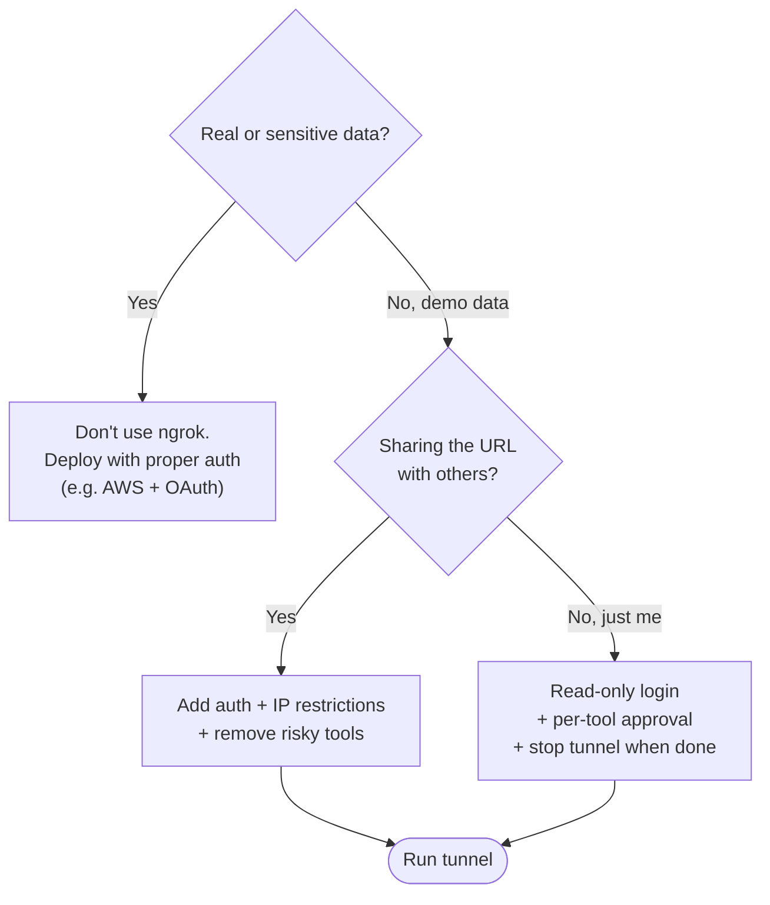

> 🔍 **Zoom:** [Open interactive view (pan/zoom)](https://mermaid.live/view#pako:eNpNkc1uwjAQhF9l5UtBEKpyRBUIiUNRWyh_qirCwcVL4uJ4I9sBoYh37yZNS32xNGPNfLsuxZ4UigGIg6HzPpUuwHoSW-CzeCiXKA2QA4_W66BPCEoGObpCFMEHer6GMJtvYzEhexeg8Ag2cXTsPX66--EEc0MXOOuQQu4oRweyCGnttbCX9GD8voIOzMestmOx--2t4mMxoy4ozKjujEVdtuiXK4bUNoGQImyWL3VaXUGsOD-6Nin9_5DjzfqJMcdK1QhcOn0Dhz44vQ-arK9jOixlxFM67Y8XCETG37D6N6yvwgfIsIF6nc44m3elIrLmAoYSbZtAHjqqckDmvIKTNI3uA-UQCmvRwDlFC4os_nVVuHX0_Lm1XRa2eblr_9hc2LixFV0QGbpMalV9YxkLXkOFNmBWhQdZmBCLa_WMJ6fVxe7ZCq5AVoqcd4sTLRMns0a-fgPkpadu)


### 10.9 Alternatives to ngrok

| Option | Good for | Notes |
|---|---|---|
| **ngrok** | Fastest demo, free static domain, request inspector | Public URL. Free plan has limits. |
| **Cloudflare Tunnel** (`cloudflared`) | Free tunnels on your own domain | Can use Cloudflare Access policies |
| **Tailscale Funnel** | Users who already use Tailscale | Public HTTPS on a `ts.net` name |
| **`mcp-remote` bridge** (§9.3) | Claude Desktop reaching an internal or VPN server | No public exposure, but Desktop only |
| **Cloud deployment** (AWS ECS / App Runner / Lambda + API Gateway) | Production, team use | Real auth, monitoring, and scaling, with data access through private networking |

---

## 11. Troubleshooting

| Symptom | Likely cause | Fix |
|---|---|---|
| Server doesn't appear | Invalid JSON, or the app wasn't fully restarted | Validate the JSON, quit fully (tray / ⌘Q), reopen |
| "Server disconnected" / failed | Bad `command` path, missing dependencies, or a crash on startup | Use absolute paths; run the same command in a terminal to see the error |
| Garbled protocol / disconnects | The server writes logs or prints to **stdout** | Log to `stderr` only |
| `spawn npx ENOENT` (Windows) | `npx` isn't on the app's PATH | Use the full path to `npx.cmd` / `node.exe`, or `"command": "cmd", "args": ["/c","npx",...]` |
| SQL login failures | Wrong instance name or escaping | `"localhost\\MSSQLSERVER03"` in JSON; check that the ODBC driver is installed |
| Tools missing in chat | Toggled off, or permission set to Blocked | Check the chat tools menu and the connector settings |

**Logs**

- Windows: `%APPDATA%\Claude\logs\mcp.log` and `mcp-server-<name>.log`
- macOS: `~/Library/Logs/Claude/mcp.log` and `mcp-server-<name>.log`

---

## 12. Security checklist

- [ ] Use a **least-privilege** service account (for example, a read-only SQL login for `my-datagpt-server`).
- [ ] Validate inputs **on the server**. Don't rely only on client permissions.
- [ ] Keep secrets in `env` or a secrets manager, never in tool descriptions or results.
- [ ] Set **Needs approval** for tools that can expose sensitive data or change state.
- [ ] Treat tool output (web pages, documents, DB text) as **untrusted**, because it can contain prompt-injection attempts.
- [ ] Install only servers you trust. A local server runs with **your OS permissions**.
- [ ] For remote servers, require **HTTPS, OAuth 2.1, and audience-bound tokens**, and validate the `Origin` header.
- [ ] Log tool calls (who, what, when) for auditing. This matters especially in regulated environments.

---

### References

- MCP specification and docs: <https://modelcontextprotocol.io>
- Python SDK: <https://github.com/modelcontextprotocol/python-sdk>
- TypeScript SDK: <https://github.com/modelcontextprotocol/typescript-sdk>
- MCP Inspector: <https://github.com/modelcontextprotocol/inspector>
- ngrok docs: <https://ngrok.com/docs>
- Reference servers: <https://github.com/modelcontextprotocol/servers>
- Claude Desktop MCP setup: <https://modelcontextprotocol.io/quickstart/user>